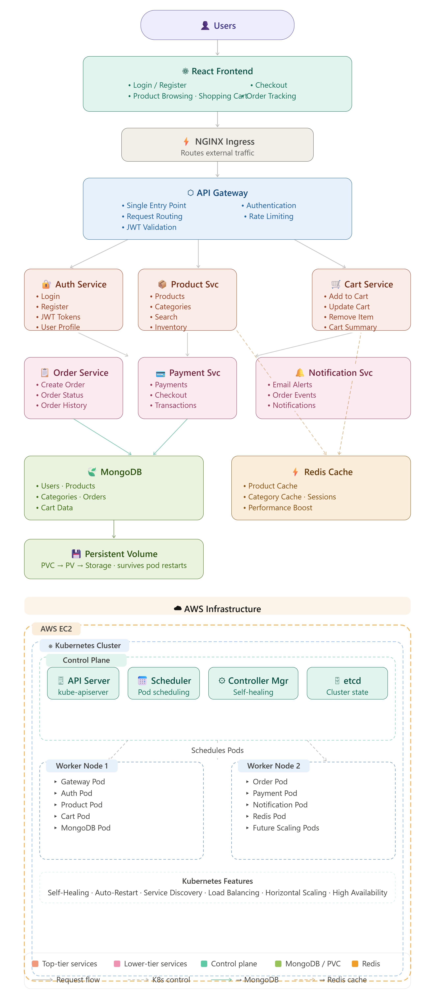

# CloudCart - Cloud Native E-Commerce Platform

## Overview

CloudCart is a cloud-native microservices-based e-commerce platform built using modern DevOps and cloud technologies.

The project demonstrates how a production-style e-commerce application can be deployed using Docker, Kubernetes, AWS EC2, MongoDB, Redis, and a microservices architecture.

This project was designed to showcase:

- Microservices Architecture
- Containerization with Docker
- Kubernetes Orchestration
- AWS Cloud Deployment
- API Gateway Pattern
- Redis Caching
- MongoDB Database Integration
- Authentication & Authorization
- High Availability Deployment

---

## Architecture



### High-Level Architecture

Users access the React frontend through a web browser.

Requests are routed through an API Gateway which forwards traffic to individual microservices.

Services communicate with:

- MongoDB for persistent storage
- Redis for caching and performance optimization

The entire platform runs inside a Kubernetes cluster hosted on AWS EC2.

---

## Technology Stack

### Frontend

- React
- TypeScript
- Vite
- Tailwind CSS

### Backend

- Node.js
- Express.js
- TypeScript

### Database

- MongoDB

### Cache

- Redis

### Containerization

- Docker

### Container Orchestration

- Kubernetes (K8s)

### Cloud Platform

- AWS EC2

### Networking

- NGINX Ingress Controller
- Kubernetes Services

---

## Microservices

### Auth Service

Responsible for:

- User Registration
- User Login
- JWT Authentication
- Refresh Tokens
- User Profile Management

---

### Product Service

Responsible for:

- Product Catalog
- Product Search
- Product Categories
- Featured Products

---

### Cart Service

Responsible for:

- Add To Cart
- Update Cart
- Remove Cart Items
- Cart Persistence

---

### Order Service

Responsible for:

- Order Creation
- Order Tracking
- Order History
- Order Status Management

---

### Payment Service

Responsible for:

- Payment Processing
- Transaction Validation
- Payment Status Updates

---

### Notification Service

Responsible for:

- Order Notifications
- Payment Notifications
- User Notifications

---

### Gateway Service

Responsible for:

- API Routing
- Request Forwarding
- Authentication Validation
- Centralized Access Point

---

## Kubernetes Deployment

The platform is deployed inside a Kubernetes cluster consisting of:

### Control Plane Node

Handles:

- API Server
- Scheduler
- Controller Manager
- etcd

### Worker Node 1

Runs:

- Gateway Service
- Auth Service
- Product Service
- Cart Service

### Worker Node 2

Runs:

- Order Service
- Payment Service
- Notification Service
- Redis

### Database Layer

Runs:

- MongoDB

---

## Features

### User Features

- User Registration
- Secure Login
- Product Browsing
- Product Search
- Shopping Cart
- Checkout
- Order Placement
- Order History

### Admin Features

- Product Management
- Category Management
- Inventory Tracking

### Infrastructure Features

- Dockerized Services
- Kubernetes Deployments
- Service Discovery
- Load Balancing
- Redis Caching
- Centralized Gateway

---

## Project Structure

```text
cloudcart
│
├── apps
├── services
├── packages
├── scripts
│
├── kubernetes
│   ├── auth-deployment.yaml
│   ├── auth-service.yaml
│   ├── cart-deployment.yaml
│   ├── product-deployment.yaml
│   ├── order-deployment.yaml
│   ├── payment-deployment.yaml
│   ├── mongodb-deployment.yaml
│   ├── redis-deployment.yaml
│   └── ingress.yaml
│
├── architecture
│   └── cloudcart_architecture_flowchart.png
│
├── screenshots
│
└── README.md
```

---

## Docker Images

The following services are containerized using Docker:

- CloudCart Frontend
- Auth Service
- Product Service
- Cart Service
- Order Service
- Payment Service
- Notification Service

Docker images are stored in Docker Hub and deployed through Kubernetes Deployments.

---

## Deployment Workflow

### Build Docker Images

```bash
docker build -t image-name .
```

### Push Images

```bash
docker push image-name
```

### Deploy to Kubernetes

```bash
kubectl apply -f kubernetes/
```

### Verify Deployment

```bash
kubectl get pods -n cloudcart
```

```bash
kubectl get svc -n cloudcart
```

```bash
kubectl get ingress -n cloudcart
```

---

## Monitoring Commands

Check Pods

```bash
kubectl get pods -n cloudcart
```

Check Services

```bash
kubectl get svc -n cloudcart
```

Check Deployments

```bash
kubectl get deployments -n cloudcart
```

Check Logs

```bash
kubectl logs deployment/auth -n cloudcart
```

Describe Resources

```bash
kubectl describe deployment auth -n cloudcart
```

---

## Screenshots

### Home Page

(Add screenshot)

### Product Catalog

(Add screenshot)

### Cart Page

(Add screenshot)

### Checkout

(Add screenshot)

### Order Confirmation

(Add screenshot)

### Kubernetes Cluster

(Add screenshot)

### Running Pods

(Add screenshot)

---

## Challenges Solved

During development and deployment the following challenges were addressed:

- Kubernetes Service Discovery
- API Gateway Authentication
- Redis Connectivity Issues
- MongoDB Integration
- JWT Token Validation
- Cross-Service Communication
- Kubernetes Ingress Configuration
- Cookie-Based Authentication
- Deployment Debugging

---

## Future Improvements

- CI/CD Pipeline using GitHub Actions
- Helm Charts
- Monitoring using Prometheus
- Grafana Dashboards
- Persistent Volumes for MongoDB
- Auto Scaling using HPA
- SSL/TLS with Cert Manager
- Production Domain Configuration

---

## Author

Suphin Hassainar

Cloud & DevOps Engineer

Technologies:

AWS | Docker | Kubernetes | Node.js | React | MongoDB | Redis

---
